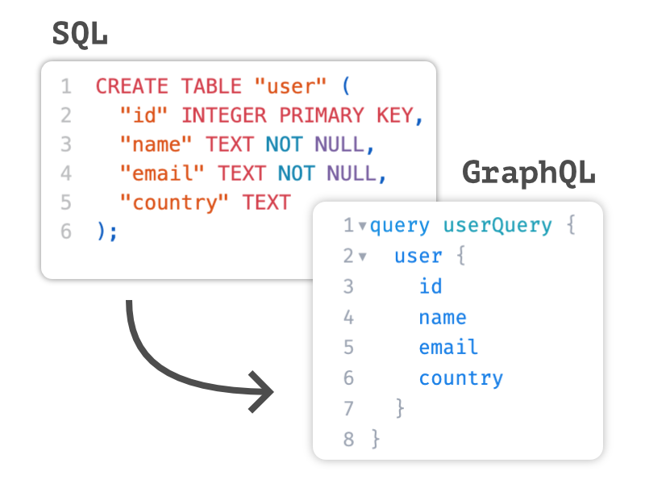

# AirGQL

Automatically generate a GraphQL API for an SQLite database.



## How It Works

It analyses the database schema
and builds the corresponding GraphQL introspection and data resolvers.

The generated API supports all basic CRUD operations and
even complex queries and mutations including filters and pagination.

It is designed to be either used a Haskell library
for integrating GraphQL support into existing servers
or as a standalone CLI app for quickly spinning up a backend.

AirGQL is the core component of [Airsequel](https://www.airsequel.com/),
which provides a complete solution for building web applications
on top of SQLite databases.


## Installation

### CLI Tool

You can install the CLI app using
[Stack](https://docs.haskellstack.org/en/stable/):

```sh
git clone https://github.com/Airsequel/AirGQL
cd AirGQL
make install
```


### Library

You can also use AirGQL in your Haskell project
by adding the [Hackage package](https://hackage.haskell.org/package/airgql)
as a dependency to your `package.yaml` or your `*.cabal` file:

```yaml
dependencies:
  - airgql
  - …
```

Also set the `lib-only` flag in your `stck.yaml` file
to avoid irrelevant errors:

```yaml
flags:
  airgql:
    lib-only: true
```


## Usage

### CLI App

Run following command to start a GraphQL API server
for an existing SQLite database:

```sh
stack run -- serve tests/example.sqlite
```

Then you can query the API like this:

```sh
http POST http://localhost:4189/graphql \
  query='query {
    songs(limit: 2) {
      id
      title
    }
  }'
```

It also supports mutations:

```sh
http POST http://localhost:4189/graphql \
  query='mutation {
    insert_songs(objects: [{ title: "New Song" }]) {
      returning {
        id
        title
      }
    }
  }'
```

Check out the documentation at
[docs.airsequel.com/graphql-api](https://docs.airsequel.com/graphql-api)
for more details on how to use all of its GraphQL features.


### Library

Check out the code in [app/Main.hs](./app/Main.hs) file for an example
of how to build a simple [Servant](https://www.servant.dev/) server
leveraging AirGQL.
